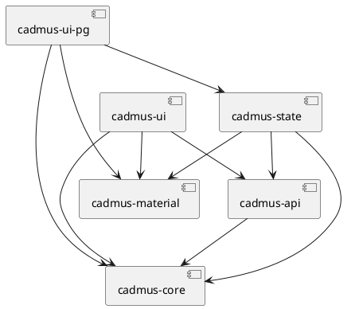
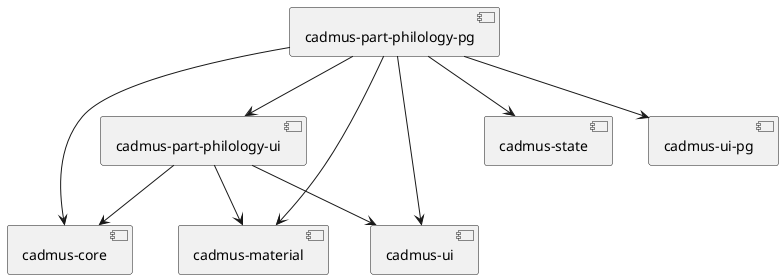

# Cadmus Shell

Quick Docker image build: `docker build . -t vedph2020/cadmus-shell:1.0.3 -t vedph2020/cadmus-shell:latest` (replace with the current version).

This project was generated with [Angular CLI](https://github.com/angular/angular-cli) version 10.1.4.

Cadmus shell project: this is a shell for the core Cadmus web app libraries. It is derived from the original `cadmus_web`, by refactoring its workspace into a pure Angular workspace, removing Nrwl dependencies. Each feature is a separate library as before; but here you can compile, pack and publish each library separately, using the "standard" Angular workspace. This should allow building new Cadmus clients by simply composing these feature libraries, and eventually adding new, specialized parts or fragments.

In the process of refactoring, the libraries were renamed from their original counterparts in `cadmus_web`. Apart from this, the code is the same, maybe with a slightly more polished TS syntax, with no effect on the compiled JS. This should allow mantaining these two codebases in parallel, until we can be reasonably sure that no issue related to Angular workspaces and this modular approach can be blocking.

The shell application is used as a development playground, where you can easily test and debug the libraries, without having to repack them each time. To this end, the shell only includes:

- general purpose Cadmus features;
- general parts and fragments;
- philological part and fragments.

You should create your own Cadmus customization by generating a new Angular application (with routing), and then importing the required libraries (see below). You can use the shell app as a sample.

For Angular workspace and libraries, you can see:

- <https://medium.com/@jinalshah999/how-to-build-and-publish-angular-library-a333d6ff12c0>
- <https://dev.to/nieds/getting-started-building-component-libraries-with-angular-cli-4ncj>

Note: should you have transient issues with the workspace, remove the `node_modules` folder, `npm i` and rebuild. Also, remember to build libraries before using them.

## Building Libraries

To **build the libraries**, you can just build each at once (`ng build LIB --prod`), or use the scripts in package.json like `npm run-script SCRIPTNAME` (for their order, note that all the libraries depend on core, and Cadmus pages depend on core and parts):

- `npm run build-lib-core`: build the core libraries.
- `npm run build-lib-p-general`: build the general parts libraries.
- `npm run build-lib-p-philology`: build the philology parts libraries.
- `npm run build-app-pg`: build the standard app's pages.
- `npm run build-all`: build all at once.

## Libraries List

Note: if you cannot view the following diagrams, you can paste their code into the [PlantUML site](https://plantuml.com).

```plantuml
@startuml
[cadmus-admin] --> [cadmus-api]
[cadmus-admin] --> [cadmus-core]
[cadmus-admin] --> [cadmus-material]
[cadmus-admin] --> [cadmus-ui]

[cadmus-api] --> [cadmus-core]

[cadmus-browser-hierarchy] --> [cadmus-core]
[cadmus-browser-hierarchy] --> [cadmus-material]
[cadmus-browser-hierarchy] --> [cadmus-part-general-ui]
[cadmus-browser-hierarchy] --> [cadmus-state]
[cadmus-browser-hierarchy] --> [cadmus-ui]

[cadmus-item-editor] --> [cadmus-api]
[cadmus-item-editor] --> [cadmus-core]
[cadmus-item-editor] --> [cadmus-material]
[cadmus-item-editor] --> [cadmus-state]
[cadmus-item-editor] --> [cadmus-ui]

[cadmus-item-list] --> [cadmus-api]
[cadmus-item-list] --> [cadmus-material]
[cadmus-item-list] --> [cadmus-state]
[cadmus-item-list] --> [cadmus-ui]

[cadmus-item-search] --> [cadmus-api]
[cadmus-item-search] --> [cadmus-material]
[cadmus-item-search] --> [cadmus-state]
[cadmus-item-search] --> [cadmus-ui]

[cadmus-layer-demo] --> [cadmus-core]
[cadmus-layer-demo] --> [cadmus-material]
[cadmus-layer-demo] --> [cadmus-ui]

[cadmus-login] --> [cadmus-material]
[cadmus-login] --> [cadmus-ui]

[cadmus-part-general-pg] --> [cadmus-core]
[cadmus-part-general-pg] --> [cadmus-material]
[cadmus-part-general-pg] --> [cadmus-part-general-ui]
[cadmus-part-general-pg] --> [cadmus-state]
[cadmus-part-general-pg] --> [cadmus-ui]
[cadmus-part-general-pg] --> [cadmus-ui-pg]

[cadmus-part-general-ui] --> [cadmus-core]
[cadmus-part-general-ui] --> [cadmus-material]
[cadmus-part-general-ui] --> [cadmus-ui]

[cadmus-part-philology-pg] --> [cadmus-core]
[cadmus-part-philology-pg] --> [cadmus-material]
[cadmus-part-philology-pg] --> [cadmus-part-philology-ui]
[cadmus-part-philology-pg] --> [cadmus-state]
[cadmus-part-philology-pg] --> [cadmus-ui]
[cadmus-part-philology-pg] --> [cadmus-ui-pg]

[cadmus-part-philology-ui] --> [cadmus-core]
[cadmus-part-philology-ui] --> [cadmus-material]
[cadmus-part-philology-ui] --> [cadmus-ui]

[cadmus-reset-password] --> [cadmus-api]
[cadmus-reset-password] --> [cadmus-core]
[cadmus-reset-password] --> [cadmus-material]
[cadmus-reset-password] --> [cadmus-ui]

[cadmus-state] --> [cadmus-api]
[cadmus-state] --> [cadmus-core]
[cadmus-state] --> [cadmus-material]

[cadmus-thesaurus-editor] --> [cadmus-api]
[cadmus-thesaurus-editor] --> [cadmus-material]
[cadmus-thesaurus-editor] --> [cadmus-state]
[cadmus-thesaurus-editor] --> [cadmus-ui]

[cadmus-thesaurus-list] --> [cadmus-api]
[cadmus-thesaurus-list] --> [cadmus-material]
[cadmus-thesaurus-list] --> [cadmus-ui]

[cadmus-ui] --> [cadmus-api]
[cadmus-ui] --> [cadmus-core]
[cadmus-ui] --> [cadmus-material]

[cadmus-ui-pg] --> [cadmus-core]
[cadmus-ui-pg] --> [cadmus-material]
[cadmus-ui-pg] --> [cadmus-state]

[cadmus-user] --> [cadmus-api]
[cadmus-user] --> [cadmus-core]
[cadmus-user] --> [cadmus-material]
[cadmus-user] --> [cadmus-ui]
@enduml
```



### Core



- `cadmus-api`: backend API services:
  - `cadmus-core`
- `cadmus-core`: core models and services.
- `cadmus-material`: Angular Material subset.
- `cadmus-state`: Akita-based state management:
  - `cadmus-api`
  - `cadmus-core`
  - `cadmus-material`
- `cadmus-ui`: dumb UI components, integrated into higher components:
  - `cadmus-api`
  - `cadmus-core`
  - `cadmus-material`
- `cadmus-ui-pg`: independent, shared UI components:
  - `cadmus-core`
  - `cadmus-material`
  - `cadmus-state`

### App Pages

```plantuml
@startuml
[cadmus-admin] --> [cadmus-api]
[cadmus-admin] --> [cadmus-core]
[cadmus-admin] --> [cadmus-material]
[cadmus-admin] --> [cadmus-ui]

[cadmus-browser-hierarchy] --> [cadmus-core]
[cadmus-browser-hierarchy] --> [cadmus-material]
[cadmus-browser-hierarchy] --> [cadmus-part-general-ui]
[cadmus-browser-hierarchy] --> [cadmus-state]
[cadmus-browser-hierarchy] --> [cadmus-ui]

[cadmus-item-editor] --> [cadmus-api]
[cadmus-item-editor] --> [cadmus-core]
[cadmus-item-editor] --> [cadmus-material]
[cadmus-item-editor] --> [cadmus-state]
[cadmus-item-editor] --> [cadmus-ui]

[cadmus-item-list] --> [cadmus-api]
[cadmus-item-list] --> [cadmus-material]
[cadmus-item-list] --> [cadmus-state]
[cadmus-item-list] --> [cadmus-ui]

[cadmus-item-search] --> [cadmus-api]
[cadmus-item-search] --> [cadmus-material]
[cadmus-item-search] --> [cadmus-state]
[cadmus-item-search] --> [cadmus-ui]

[cadmus-layer-demo] --> [cadmus-core]
[cadmus-layer-demo] --> [cadmus-material]
[cadmus-layer-demo] --> [cadmus-ui]

[cadmus-login] --> [cadmus-material]
[cadmus-login] --> [cadmus-ui]

[cadmus-reset-password] --> [cadmus-api]
[cadmus-reset-password] --> [cadmus-core]
[cadmus-reset-password] --> [cadmus-material]
[cadmus-reset-password] --> [cadmus-ui]

[cadmus-thesaurus-editor] --> [cadmus-api]
[cadmus-thesaurus-editor] --> [cadmus-material]
[cadmus-thesaurus-editor] --> [cadmus-state]
[cadmus-thesaurus-editor] --> [cadmus-ui]

[cadmus-thesaurus-list] --> [cadmus-api]
[cadmus-thesaurus-list] --> [cadmus-material]
[cadmus-thesaurus-list] --> [cadmus-ui]

[cadmus-user] --> [cadmus-api]
[cadmus-user] --> [cadmus-core]
[cadmus-user] --> [cadmus-material]
[cadmus-user] --> [cadmus-ui]
@enduml
```



- `cadmus-admin`: admin page:
  - `cadmus-api`
  - `cadmus-core`
  - `cadmus-material`
  - `cadmus-ui`
- `cadmus-browser-hierarchy`: hierarchical items browser:
  - `cadmus-core`
  - `cadmus-material`
  - `cadmus-part-general-ui`
  - `cadmus-state`
  - `cadmus-ui`
- `cadmus-item-editor`: item's editor:
  - `cadmus-api`
  - `cadmus-core`
  - `cadmus-material`
  - `cadmus-state`
  - `cadmus-ui`
- `cadmus-item-list`: items list:
  - `cadmus-api`
  - `cadmus-material`
  - `cadmus-state`
  - `cadmus-ui`
- `cadmus-item-search`: items search:
  - `cadmus-api`
  - `cadmus-material`
  - `cadmus-state`
  - `cadmus-ui`
- `cadmus-layer-demo`: layer coordinates demo:
  - `cadmus-core`
  - `cadmus-material`
  - `cadmus-ui`
- `cadmus-login`: login page:
  - `cadmus-material`
  - `cadmus-ui`
- `cadmus-reset-password`: reset password page:
  - `cadmus-api`
  - `cadmus-core`
  - `cadmus-material`
  - `cadmus-ui`
- `cadmus-thesaurus-editor`: thesaurus' editor page:
  - `cadmus-api`
  - `cadmus-material`
  - `cadmus-state`
  - `cadmus-ui`
- `cadmus-thesaurus-list`: thesauri list page:
  - `cadmus-api`
  - `cadmus-material`
  - `cadmus-ui`
- `cadmus-user`: personal user page:
  - `cadmus-api`
  - `cadmus-core`
  - `cadmus-material`
  - `cadmus-ui`

### General Parts


- `cadmus-part-general-pg`: general part editors pages:
  - `cadmus-core`
  - `cadmus-material`
  - `cadmus-part-general-ui`
  - `cadmus-state`
  - `cadmus-ui`
  - `cadmus-ui-pg`
- `cadmus-part-general-ui`: general part editors UI components, integrated into general part editors pages:
  - `cadmus-core`
  - `cadmus-material`
  - `cadmus-ui`

### Philology Parts



- `cadmus-part-philology-pg`: philological parts editors pages:
  - `cadmus-core`
  - `cadmus-material`
  - `cadmus-part-philology-ui`:
  - `cadmus-state`
  - `cadmus-ui`
  - `cadmus-ui-pg`
- `cadmus-part-philology-ui`: philological part editors UI components, integrated into philological part editors pages:
  - `cadmus-core`
  - `cadmus-material`
  - `cadmus-ui`

## Building a New App by Composition

1. create a new Angular app with routing: `ng new APPNAME`. This will be the host app for testing your libraries.

2. from the new app's root folder, run `ng generate library LIBNAME`. This creates a library under `projects/LIBNAME`.

3. add components as needed in your library. Everything to be exported must be listed in `src/public-api.ts`.

When **adding packages** to your library, add them to the shell app instead; then copy their references from the shell app `package.json` into the library `package.json` but in its `peerDependencies` section. Otherwise, keeping them in `dependencies` would conflict with the same packages being loaded by the host app.

Also, mind these **peculiarities** in a lib:

- when exporting a plain class, prefix its declaration with a `// @dynamic` comment: see <https://github.com/angular/angular/issues/18867#issuecomment-357484102>. Otherwise, you will get strange errors about metadata generated for exported symbols.

- when using child routes, define them as follows:

```ts
// https://github.com/ng-packagr/ng-packagr/issues/778
export const RouterModuleForChild = RouterModule.forChild([
  // add your routes here...
]);
```

and then just add `RouterModuleForChild` to your library module `imports`.

- to avoid UMD bundling warnings (like "No name was provided for external module..."), in the lib's `ng-package.json` add a `umdModuleIds` section with explicit mappings for each module listed in the warnings (<https://stackoverflow.com/questions/48616267/ng-packagr-gives-no-name-was-provided-for-external-module/53521270>), e.g.:

```json
"lib": {
  "entryFile": "src/public-api.ts",
  "umdModuleIds": {
    "cadmus-core": "cadmus-core",
    "cadmus-material": "cadmus-material",
    "cadmus-api": "cadmus-api",
    "cadmus-ui": "cadmus-ui"
  }
}
```

### Building a Web App

1. `ng new APPNAME`. Use routing and CSS.

2. add Material support: `ng add @angular/material`.

3. add these packages (to `package.json`) and `npm i`:

```json
"@angular/flex-layout": "^10.0.0-beta.32",
"@auth0/angular-jwt": "^5.0.1",
"@datorama/akita": "^5.2.3",
"@datorama/akita-ngdevtools": "^5.0.3",
"@types/diff-match-patch": "^1.0.32",
"diff-match-patch": "^1.0.5",
"gravatar": "^1.8.1",
"moment": "^2.28.0",
"ngx-markdown": "^10.1.1",
"ngx-moment": "^5.0.0",
"ngx-monaco-editor": "^8.1.1",
"rangy": "^1.3.0",
```

4. `angular.json`, under `projects/APPNAME/architect/build/options/assets`:

   - add `src/env.js`. For its content, see `cadmus-shell`. You must change all the data there, to fit your project: name, database name, and API port.
   - add a glob for monaco. The result would be something like this (see <https://www.npmjs.com/package/ngx-monaco-editor>):

```json
"assets": [
  "src/favicon.ico",
  "src/assets",
  "src/env.js",
  {
    "glob": "**/*",
    "input": "node_modules/ngx-monaco-editor/assets/monaco",
    "output": "/assets/monaco"
  }
],
```

5. `angular.json`: following the suggestions in <https://stackoverflow.com/questions/54891679/how-do-i-get-source-map-working-for-npm-linked-angular-library>, and the [Angular docs]<https://angular.io/guide/workspace-config#optimization-and-source-map-configuration>, explicitly opt for the source maps (under `projects/app/architect/build/options`):

```json
"sourceMap": {
  "scripts": true,
  "styles": true,
  "hidden": false,
  "vendor": true
},
"preserveSymlinks": true
```

Here, `preserveSymlinks` is added as a sample for the "real" apps which will consume the libraries, to let them preserve symlinks to `npm link`-ed libraries).

Also, the `vendorSourceMap` option suggested in the above link no more belongs to the JSON schema. I found it in many older posts about sourcemaps, but it was deprecated in 7 (<https://blog.ninja-squad.com/2019/01/09/angular-cli-7.2/>), and replaced by the `vendor` property in `sourceMap`.

6. `angular.json`, also add `"sourceMap": true` to the shell app's `angular.json` at `projects/app/architect/build/configurations/production`, as anyway I'm not going to hide any maps, because this is an open source project; so I followed the advice from [this post](https://medium.com/angular-in-depth/debug-angular-apps-in-production-without-revealing-source-maps-ab4a235edd85).

7. `tsconfig.json`:

- add `"allowSyntheticDefaultImports": true`.

8. `index.html`:

- add this script before `</head>`:

```html
<!-- Load environment variables -->
<script src="env.js"></script>
```

Ensure that the root component there is named after app.component's selector (e.g. `cadmus-root`).

9. `styles.css`: add these imports:

```css
@import "~@angular/material/prebuilt-themes/indigo-pink.css";
/* Offline material icons: used for developing.
   To remove, just comment out this import.
   The local font files are under assets/icons. If you want to totally
   remove local icons, just delete the whole folder besides removing
   this import. Their source is
   https://github.com/google/material-design-icons/tree/master/iconfont
   (when downloading from there, open each file in GitHub and click Download,
   as right clicking on the file name and selecting Download link as won't
   work as expected, producing corrupt files).
 */
@import "assets/icons/material-icons.css";
```

10. create your additional libraries or import existing ones. To create a library: `ng generate library cadmus-NAME`. For instance, in Cadmus shell these libraries were generated:

```bash
ng generate library cadmus-admin
ng generate library cadmus-api
ng generate library cadmus-browser-hierarchy
ng generate library cadmus-core
ng generate library cadmus-item-editor
ng generate library cadmus-item-list
ng generate library cadmus-item-search
ng generate library cadmus-layer-demo
ng generate library cadmus-login
ng generate library cadmus-material
ng generate library cadmus-part-general-pg
ng generate library cadmus-part-general-ui
ng generate library cadmus-part-philology-pg
ng generate library cadmus-part-philology-ui
ng generate library cadmus-reset-password
ng generate library cadmus-state
ng generate library cadmus-thesaurus-editor
ng generate library cadmus-thesaurus-list
ng generate library cadmus-ui
ng generate library cadmus-ui-pg
ng generate library cadmus-user
```

11. add the corresponding commands to `package.json` scripts, e.g.:

```json
[
  "build-lib-core": "ng build cadmus-core --prod && ng build cadmus-material --prod && ng build cadmus-api --prod && ng build cadmus-ui --prod && ng build cadmus-state --prod && ng build cadmus-ui-pg --prod",
  "build-lib-p-general": "ng build cadmus-part-general-ui --prod && ng build cadmus-part-general-pg --prod",
  "build-lib-p-philology": "ng build cadmus-part-philology-ui --prod && ng build cadmus-part-philology-pg --prod",
  "build-app-pg": "ng build cadmus-admin --prod && ng build cadmus-browser-hierarchy --prod && ng build cadmus-item-editor --prod && ng build cadmus-item-list --prod && ng build cadmus-item-search --prod && ng build cadmus-layer-demo --prod && ng build cadmus-login --prod && ng build cadmus-reset-password --prod && ng build cadmus-thesaurus-editor --prod && ng build cadmus-thesaurus-list --prod && ng build cadmus-user --prod",
  "build-all": "npm run-script build-lib-core && npm run-script build-lib-p-general && npm run-script build-lib-p-philology && npm run-script build-app-pg"
]
```

12. ensure you have the required icons and images in `assets` (see `cadmus-shell/assets`).

13. add the required constants in files, eventually removing what is not needed and adding new entries for your new parts:

- `src/app/index-lookup-definitions.ts`
- `src/app/item-browser-keys.ts`
- `src/app/part-editor-keys.ts`

14. add the required metadata in `app.module.ts` (see `cadmus-shell`).

15. copy `app` component from `cadmus-shell` and eventually customize it.

16. copy `home` component from `cadmus-shell` and eventually customize it.

17. if you want to include demos, copy the `demo` folder.

### Consuming Libraries from the Host App

Before consuming the library, you must always build it: `ng build LIBNAME --prod` (mind the `--prod` flag! This allows the library to be consumed by both non-Ivy and Ivy clients).

You can then import it in the host app as any other library, like `import { MyDemoLibModule } from 'my-demo-lib';`.

### Consuming Libraries from Local NPM

You can build this library as an npm package and then publish it to the local node package manager's registry, so that we can use it in any angular projects which are in our local machine.

1. once you have built the library, open the Terminal in your library folder from the `dist/LIBNAME` directory, and then write a command to create the Pack file: `npm pack`.

2. copy the absolute path of the library project (up to `...dist/LIBNAME/LIBNAME.TGZ`).

3. from your consumer app root folder, use `npm install PATH-TO-LIB-TGZ`.
