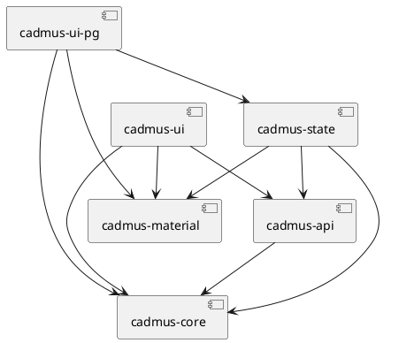
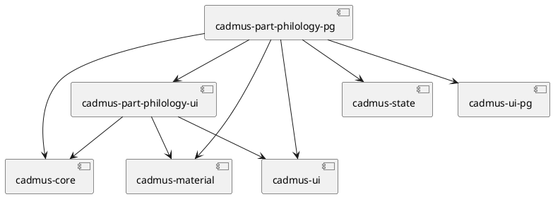

# Cadmus Shell

Quick Docker image build:

1. `npm run build-all`
2. `ng build --prod`
3. `docker build . -t vedph2020/cadmus-shell:1.0.4 -t vedph2020/cadmus-shell:latest` (replace with the current version).

This project was generated with [Angular CLI](https://github.com/angular/angular-cli) version 10.1.4.

Cadmus shell project: this is a shell for the core Cadmus web app libraries. It is derived from the original `cadmus_web`, by refactoring its workspace into a pure Angular workspace, removing Nrwl dependencies. Each feature is a separate library as before; but here you can compile, pack and publish each library separately, using the "standard" Angular workspace. This allows building new Cadmus clients by simply composing these feature libraries, and eventually adding new, specialized parts or fragments.

In the process of refactoring, the libraries were renamed from their original counterparts in `cadmus_web`.

The shell application is used as a development playground, where you can easily test and debug the libraries, without having to repack them each time. To this end, the shell only includes:

- general purpose Cadmus features;
- general parts and fragments;
- philological part and fragments.

You should create your own Cadmus customization by generating a new Angular application (with routing), and then importing the required libraries (see below). You can use the shell app as a sample.

For Angular workspace and libraries, you can see:

- <https://medium.com/@jinalshah999/how-to-build-and-publish-angular-library-a333d6ff12c0>
- <https://dev.to/nieds/getting-started-building-component-libraries-with-angular-cli-4ncj>

Note: should you have transient issues with the workspace, remove the `node_modules` folder, `npm i` and rebuild. Also, remember to build libraries before using them.

## History

- 2021-11-20: migrated Angular compiler to strict mode, with a lot of minute fixes in all the libraries except for Cadmus material. All the libraries affected have bumped their version to 0.3.0.
- 2021-11-20: replaced some code in core and ui with code from `@myrmidon/ng-tools` and `@myrmidon/ng-mat-tools`. All the libraries affected have bumped their version to 0.2.0. When upgrading to these versions, ensure you also npm install the ng- libraries.

## Building Libraries

To **build the libraries**, you can just build each at once (`ng build LIB --prod`), or use the scripts in package.json like `npm run-script SCRIPTNAME` (for their order, note that all the libraries depend on core, and Cadmus pages depend on core and parts):

- `npm run build-lib-core`: build the core libraries.
- `npm run build-lib-p-general`: build the general parts libraries.
- `npm run build-lib-p-philology`: build the philology parts libraries.
- `npm run build-app-pg`: build the standard app's pages.
- `npm run build-all`: build all at once.

## Libraries List

Note: if you cannot view the following diagrams, you can paste their code into the [PlantUML site](https://plantuml.com).

```plantuml
@startuml
[cadmus-admin] --> [cadmus-api]
[cadmus-admin] --> [cadmus-core]
[cadmus-admin] --> [cadmus-material]
[cadmus-admin] --> [cadmus-ui]

[cadmus-api] --> [cadmus-core]

[cadmus-browser-hierarchy] --> [cadmus-core]
[cadmus-browser-hierarchy] --> [cadmus-material]
[cadmus-browser-hierarchy] --> [cadmus-part-general-ui]
[cadmus-browser-hierarchy] --> [cadmus-state]
[cadmus-browser-hierarchy] --> [cadmus-ui]

[cadmus-item-editor] --> [cadmus-api]
[cadmus-item-editor] --> [cadmus-core]
[cadmus-item-editor] --> [cadmus-material]
[cadmus-item-editor] --> [cadmus-state]
[cadmus-item-editor] --> [cadmus-ui]

[cadmus-item-list] --> [cadmus-api]
[cadmus-item-list] --> [cadmus-material]
[cadmus-item-list] --> [cadmus-state]
[cadmus-item-list] --> [cadmus-ui]

[cadmus-item-search] --> [cadmus-api]
[cadmus-item-search] --> [cadmus-material]
[cadmus-item-search] --> [cadmus-state]
[cadmus-item-search] --> [cadmus-ui]

[cadmus-layer-demo] --> [cadmus-core]
[cadmus-layer-demo] --> [cadmus-material]
[cadmus-layer-demo] --> [cadmus-ui]

[cadmus-login] --> [cadmus-material]
[cadmus-login] --> [cadmus-ui]

[cadmus-part-general-pg] --> [cadmus-core]
[cadmus-part-general-pg] --> [cadmus-material]
[cadmus-part-general-pg] --> [cadmus-part-general-ui]
[cadmus-part-general-pg] --> [cadmus-state]
[cadmus-part-general-pg] --> [cadmus-ui]
[cadmus-part-general-pg] --> [cadmus-ui-pg]

[cadmus-part-general-ui] --> [cadmus-core]
[cadmus-part-general-ui] --> [cadmus-material]
[cadmus-part-general-ui] --> [cadmus-ui]

[cadmus-part-philology-pg] --> [cadmus-core]
[cadmus-part-philology-pg] --> [cadmus-material]
[cadmus-part-philology-pg] --> [cadmus-part-philology-ui]
[cadmus-part-philology-pg] --> [cadmus-state]
[cadmus-part-philology-pg] --> [cadmus-ui]
[cadmus-part-philology-pg] --> [cadmus-ui-pg]

[cadmus-part-philology-ui] --> [cadmus-core]
[cadmus-part-philology-ui] --> [cadmus-material]
[cadmus-part-philology-ui] --> [cadmus-ui]

[cadmus-reset-password] --> [cadmus-api]
[cadmus-reset-password] --> [cadmus-core]
[cadmus-reset-password] --> [cadmus-material]
[cadmus-reset-password] --> [cadmus-ui]

[cadmus-state] --> [cadmus-api]
[cadmus-state] --> [cadmus-core]
[cadmus-state] --> [cadmus-material]

[cadmus-thesaurus-editor] --> [cadmus-api]
[cadmus-thesaurus-editor] --> [cadmus-material]
[cadmus-thesaurus-editor] --> [cadmus-state]
[cadmus-thesaurus-editor] --> [cadmus-ui]

[cadmus-thesaurus-list] --> [cadmus-api]
[cadmus-thesaurus-list] --> [cadmus-material]
[cadmus-thesaurus-list] --> [cadmus-ui]

[cadmus-ui] --> [cadmus-api]
[cadmus-ui] --> [cadmus-core]
[cadmus-ui] --> [cadmus-material]

[cadmus-ui-pg] --> [cadmus-core]
[cadmus-ui-pg] --> [cadmus-material]
[cadmus-ui-pg] --> [cadmus-state]

[cadmus-user] --> [cadmus-api]
[cadmus-user] --> [cadmus-core]
[cadmus-user] --> [cadmus-material]
[cadmus-user] --> [cadmus-ui]
@enduml
```

### Core

- `cadmus-api`: backend API services:
  - `cadmus-core`
- `cadmus-core`: core models and services.
- `cadmus-material`: Angular Material subset.
- `cadmus-state`: Akita-based state management:
  - `cadmus-api`
  - `cadmus-core`
  - `cadmus-material`
- `cadmus-ui`: dumb UI components, integrated into higher components:
  - `cadmus-api`
  - `cadmus-core`
  - `cadmus-material`
- `cadmus-ui-pg`: independent, shared UI components:
  - `cadmus-core`
  - `cadmus-material`
  - `cadmus-state`

### App Pages

```plantuml
@startuml
[cadmus-admin] --> [cadmus-api]
[cadmus-admin] --> [cadmus-core]
[cadmus-admin] --> [cadmus-material]
[cadmus-admin] --> [cadmus-ui]

[cadmus-browser-hierarchy] --> [cadmus-core]
[cadmus-browser-hierarchy] --> [cadmus-material]
[cadmus-browser-hierarchy] --> [cadmus-part-general-ui]
[cadmus-browser-hierarchy] --> [cadmus-state]
[cadmus-browser-hierarchy] --> [cadmus-ui]

[cadmus-item-editor] --> [cadmus-api]
[cadmus-item-editor] --> [cadmus-core]
[cadmus-item-editor] --> [cadmus-material]
[cadmus-item-editor] --> [cadmus-state]
[cadmus-item-editor] --> [cadmus-ui]

[cadmus-item-list] --> [cadmus-api]
[cadmus-item-list] --> [cadmus-material]
[cadmus-item-list] --> [cadmus-state]
[cadmus-item-list] --> [cadmus-ui]

[cadmus-item-search] --> [cadmus-api]
[cadmus-item-search] --> [cadmus-material]
[cadmus-item-search] --> [cadmus-state]
[cadmus-item-search] --> [cadmus-ui]

[cadmus-layer-demo] --> [cadmus-core]
[cadmus-layer-demo] --> [cadmus-material]
[cadmus-layer-demo] --> [cadmus-ui]

[cadmus-login] --> [cadmus-material]
[cadmus-login] --> [cadmus-ui]

[cadmus-reset-password] --> [cadmus-api]
[cadmus-reset-password] --> [cadmus-core]
[cadmus-reset-password] --> [cadmus-material]
[cadmus-reset-password] --> [cadmus-ui]

[cadmus-thesaurus-editor] --> [cadmus-api]
[cadmus-thesaurus-editor] --> [cadmus-material]
[cadmus-thesaurus-editor] --> [cadmus-state]
[cadmus-thesaurus-editor] --> [cadmus-ui]

[cadmus-thesaurus-list] --> [cadmus-api]
[cadmus-thesaurus-list] --> [cadmus-material]
[cadmus-thesaurus-list] --> [cadmus-ui]

[cadmus-user] --> [cadmus-api]
[cadmus-user] --> [cadmus-core]
[cadmus-user] --> [cadmus-material]
[cadmus-user] --> [cadmus-ui]
@enduml
```

- `cadmus-admin`: admin page:
  - `cadmus-api`
  - `cadmus-core`
  - `cadmus-material`
  - `cadmus-ui`
- `cadmus-browser-hierarchy`: hierarchical items browser:
  - `cadmus-core`
  - `cadmus-material`
  - `cadmus-part-general-ui`
  - `cadmus-state`
  - `cadmus-ui`
- `cadmus-item-editor`: item's editor:
  - `cadmus-api`
  - `cadmus-core`
  - `cadmus-material`
  - `cadmus-state`
  - `cadmus-ui`
- `cadmus-item-list`: items list:
  - `cadmus-api`
  - `cadmus-material`
  - `cadmus-state`
  - `cadmus-ui`
- `cadmus-item-search`: items search:
  - `cadmus-api`
  - `cadmus-material`
  - `cadmus-state`
  - `cadmus-ui`
- `cadmus-layer-demo`: layer coordinates demo:
  - `cadmus-core`
  - `cadmus-material`
  - `cadmus-ui`
- `cadmus-login`: login page:
  - `cadmus-material`
  - `cadmus-ui`
- `cadmus-reset-password`: reset password page:
  - `cadmus-api`
  - `cadmus-core`
  - `cadmus-material`
  - `cadmus-ui`
- `cadmus-thesaurus-editor`: thesaurus' editor page:
  - `cadmus-api`
  - `cadmus-material`
  - `cadmus-state`
  - `cadmus-ui`
- `cadmus-thesaurus-list`: thesauri list page:
  - `cadmus-api`
  - `cadmus-material`
  - `cadmus-ui`
- `cadmus-user`: personal user page:
  - `cadmus-api`
  - `cadmus-core`
  - `cadmus-material`
  - `cadmus-ui`

### General Parts

- `cadmus-part-general-pg`: general part editors pages:
  - `cadmus-core`
  - `cadmus-material`
  - `cadmus-part-general-ui`
  - `cadmus-state`
  - `cadmus-ui`
  - `cadmus-ui-pg`
- `cadmus-part-general-ui`: general part editors UI components, integrated into general part editors pages:
  - `cadmus-core`
  - `cadmus-material`
  - `cadmus-ui`

### Philology Parts

- `cadmus-part-philology-pg`: philological parts editors pages:
  - `cadmus-core`
  - `cadmus-material`
  - `cadmus-part-philology-ui`:
  - `cadmus-state`
  - `cadmus-ui`
  - `cadmus-ui-pg`
- `cadmus-part-philology-ui`: philological part editors UI components, integrated into philological part editors pages:
  - `cadmus-core`
  - `cadmus-material`
  - `cadmus-ui`

## Building a New App by Composition

See [creating a Cadmus app](https://github.com/vedph/cadmus_doc/blob/master/web/creating.md) in the documentation.

### Consuming Libraries from the Host App

Before consuming the library, you must always build it: `ng build LIBNAME --prod` (mind the `--prod` flag! This allows the library to be consumed by both non-Ivy and Ivy clients).

You can then import it in the host app as any other library, like `import { MyDemoLibModule } from 'my-demo-lib';`.

### Consuming Libraries from Local NPM

You can build this library as an npm package and then publish it to the local node package manager's registry, so that we can use it in any angular projects which are in our local machine.

1. once you have built the library, open the Terminal in your library folder from the `dist/LIBNAME` directory, and then write a command to create the Pack file: `npm pack`.

2. copy the absolute path of the library project (up to `...dist/LIBNAME/LIBNAME.TGZ`).

3. from your consumer app root folder, use `npm install PATH-TO-LIB-TGZ`.
